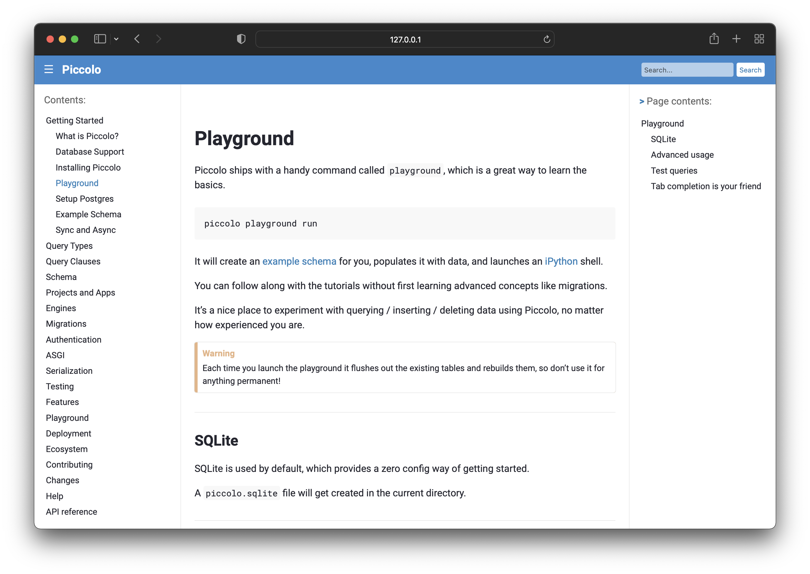
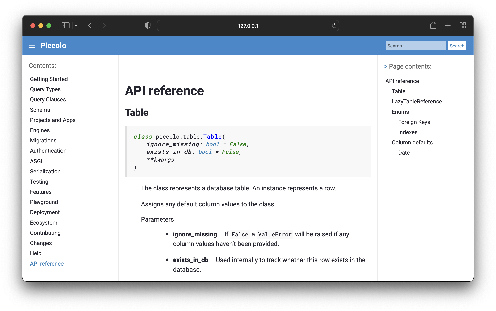

# Piccolo Theme

A clean and modern Sphinx theme.


## Typography

Roboto is used for the body copy, and Roboto Mono for code snippets. As these
fonts belong to the same family, they look nice together. Both of them are
also highly legible on small screens.

We use bold, easy to read headers.

## Code docs

We make your autodoc code snippets nice and legible:



## Other design features

 * Optimised for mobile and web.
 * A header bar gives the design a splash of colour.
 * Simple but elegant design.

## Contributing

### Building styles

In the root of the project:

```
npm install -g sass
```

Then:

```
./scripts/build-styles.sh
```
